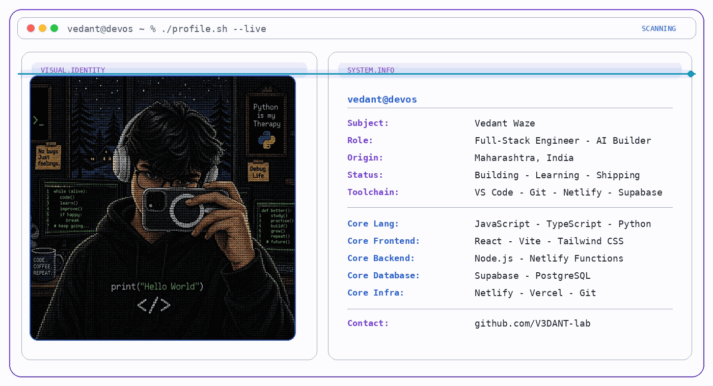
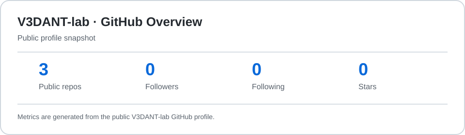
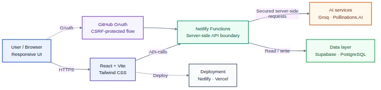
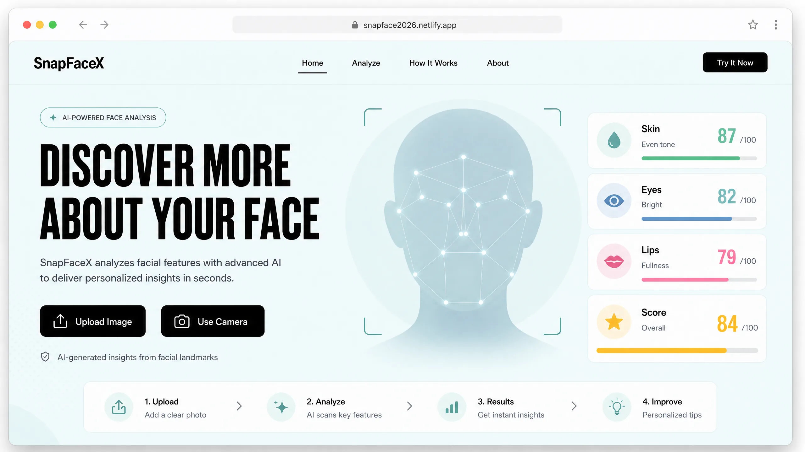
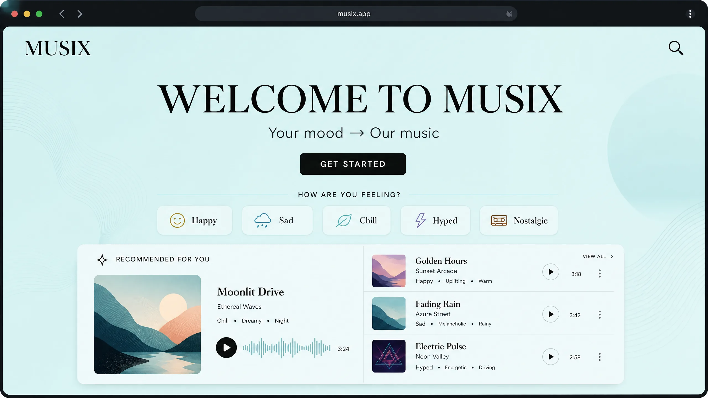

<a href="https://github.com/V3DANT-lab/V3DANT-lab">
  <picture>
    <source media="(prefers-color-scheme: dark)" srcset="./assets/visual-identity-scan-dark.gif">
    
  </picture>
</a>

<p align="center">
  <picture>
    <source media="(prefers-color-scheme: dark)" srcset="./dist/v3dant-contribution-dark.svg">
    
  </picture>
</p>

# Vedant Waze

**Full-Stack Engineer · AI Builder · Python Student**

Building projects from scratch, documenting the journey, and shipping practical AI-powered products.

[](https://github.com/V3DANT-lab)
[](https://portfolio123v.netlify.app)
[](https://instagram.com/v.edant_20)
[](mailto:wazevedant5@gmail.com)

```text
vedant@devos ~ % ./profile.sh --live
```

<details open>
<summary><strong>System profile</strong></summary>

**Subject:** Vedant Waze  
**Role:** Full-Stack Engineer · AI Builder  
**Origin:** Maharashtra, India  
**Status:** Building · Learning · Shipping  
**Toolchain:** VS Code · Git · Netlify · Supabase

**Core languages:** JavaScript · TypeScript · Python · HTML · CSS  
**Frontend:** React · Vite · Tailwind CSS  
**Backend:** Node.js · Netlify Functions  
**Data:** Supabase · PostgreSQL  
**Infrastructure:** Netlify · Vercel · Git

</details>

## About Me

I'm a self-directed **full-stack developer and AI builder**, currently shipping real, production-grade web applications. My focus is secure, AI-integrated systems—not tutorials, but deployed products.

- Full-stack engineering with a product mindset
- Practical LLM and generative AI integration with Groq and Pollinations.AI
- Security-first architecture, including remediation of exposed API keys

## GitHub Statistics

<p align="center">
  <picture>
    <source media="(prefers-color-scheme: dark)" srcset="./assets/github-stats-dark.svg">
    <source media="(prefers-color-scheme: light)" srcset="./assets/github-stats-light.svg">
    
  </picture>
</p>

<p align="center">
  <picture>
    <source media="(prefers-color-scheme: dark)" srcset="./assets/github-streak-dark.svg">
    <source media="(prefers-color-scheme: light)" srcset="./assets/github-streak-light.svg">
    
  </picture>
</p>

## Tech Stack

<p align="center">
  <picture>
    <source media="(prefers-color-scheme: dark)" srcset="https://skillicons.dev/icons?i=js,ts,py,html,css&amp;theme=dark">
    <source media="(prefers-color-scheme: light)" srcset="https://skillicons.dev/icons?i=js,ts,py,html,css&amp;theme=light">
    
  </picture>
  <br>
  <picture>
    <source media="(prefers-color-scheme: dark)" srcset="https://skillicons.dev/icons?i=react,vite,tailwind&amp;theme=dark">
    <source media="(prefers-color-scheme: light)" srcset="https://skillicons.dev/icons?i=react,vite,tailwind&amp;theme=light">
    
  </picture>
  <br>
  <picture>
    <source media="(prefers-color-scheme: dark)" srcset="https://skillicons.dev/icons?i=nodejs,supabase,postgres&amp;theme=dark">
    <source media="(prefers-color-scheme: light)" srcset="https://skillicons.dev/icons?i=nodejs,supabase,postgres&amp;theme=light">
    
  </picture>
  <br>
  <picture>
    <source media="(prefers-color-scheme: dark)" srcset="https://skillicons.dev/icons?i=netlify,git,github,vscode,vercel&amp;theme=dark">
    <source media="(prefers-color-scheme: light)" srcset="https://skillicons.dev/icons?i=netlify,git,github,vscode,vercel&amp;theme=light">
    
  </picture>
</p>

## Architecture Overview

<p align="center">
  <picture>
    <source media="(prefers-color-scheme: dark)" srcset="./assets/architecture-dark.webp">
    <source media="(prefers-color-scheme: light)" srcset="./assets/architecture-light.webp">
    
  </picture>
</p>

## Featured Projects

<details open>
<summary><strong>DripIQ — AI Fashion Assistant</strong></summary>

AI-powered fashion app generating outfit visualizations across head, mid, and lower slots through generative image models, with Groq-powered recommendations.


**Stack:** Vite · Supabase · Groq API · Pollinations.AI · Netlify Functions  
**Security:** Server-side-only API keys with zero client-exposed secrets  
**Status:** Actively in development

</details>

<details>
<summary><strong>SnapFaceX — AI Face Analysis Tool</strong></summary>

Live AI-powered face analysis platform combining MediaPipe FaceMesh landmark detection with LLM-generated feedback.



**Stack:** MediaPipe FaceMesh · Groq (Llama-3.3-70B) · GitHub OAuth · Netlify Functions  
**Security:** Server-side proxy for API-key protection and CSRF-protected OAuth  
**Live:** [snapface2026.netlify.app](https://snapface2026.netlify.app)

</details>

<details open>
<summary><strong>Musix — AI Mood-Based Music Discovery</strong></summary>

Mood-based music discovery experience that helps users find song recommendations matching how they feel, without endless scrolling.



[Live Demo](https://musix2026.netlify.app)

**Highlights:** Mood selection · Recommendation cards · AI-assisted music discovery · Responsive web experience

</details>

## Connect

<p align="center">
  <a href="https://github.com/V3DANT-lab"></a>
  <a href="https://instagram.com/v.edant_20"></a>
  <a href="https://portfolio123v.netlify.app"></a>
  <a href="mailto:wazevedant5@gmail.com"></a>
</p>

<div align="center">

*Build in silence, let the shipped product speak.*

</div>
