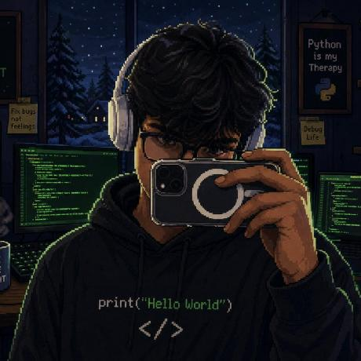

```
<div align="center">
```

# `# Vedant Waze` 

```
**Full-Stack Engineer · AI Builder · Python Student**
```

```
Building projects from scratch, documenting the journey, and shipping practical
AI-powered products.
```

```
[](https://github.com/V3DANT-lab)
```

```
[](https://portfolio123v.netlify.app)
[](https://instagram.com/
v.edant_20)
```

```
[](mailto:wazevedant5@gmail.com)
```

# `</div>` 

# `## Visual Identity` 

```
<div align="center">
```

```
  
```

```
  <br><br>
```

```
  <pre>
```

|`:*.                      .-:       ::`|
|---|
|`+@            .           @@ =     +=`|
|`+ -@   -- =  :  @                :.       @@ +`|
|`=  =    *       @ #              .       -+  +     ..`|
|`= :#  .  . @ :  @ %%  -.                 @   =`|
|`*         -  @ -=  @   :              @   -  @:*%`|
|`@@+-@            @  + .@:                 @   -  =  -`|
|`.  =:  @  -                +@   @   :  @  +`|
|`== *@+ *: =@   %.+             # +=@      @+*@`|
|`.                 @@ @* @.  =   .    =   :*`|
|`: -##  -=-++-.  :    @  +     # -  ++@ #@ =@@@@`|
|`:   %                @   @@@%*@*#*@:%@+:      -@`<br>|
|`%*#-#:+-        @  @.   +                 @`|
|`. :  -             + @: =    .   @@@@ =@@@@@ . :@`|
|`: :  =+: ::+:=   @@@  @ @  . -  @@   +@@@. @@@+ #   @@@*=@-`|
|`-             @+    @ # +  . @*  @=         +-%@  . .=.`|
|`: :+     ::: :@  =: @=+ .    @      @@         @  +  :`|
|`-  %@@*-:+:  @   .  +.# -=+  @    : @@ .#@@@*. :@ * .`<br>|
|`-           =@      + @      @  :.  @  .%*.    @@ + .*`|
|`.  -  #@. *-+  @       * @      @@    .@ @:     # *@ = =:`|
|`. :   -:.-.+ @%      +. +       @@@@@@ #   @@#:   @ :`|
|`@ :  %       #  .     : @         @@  .  :@#  -.  @   =%`|
|`.  =-.  ..   @@          .*-:::@ .    @: -@    +.  @     .*.`<br>|
|`.          @@            -           #*  @     ::  @*+ -`|
|`@:              @.             : =:  - - *  @`|
|`:@      @@                                  * .# : =@`|
|`:@     @@                                   =  =    %   +`|
|`@    %@  .                                   . :.    @ @`|
|`.# .  @                                       *  . += @  @`|
|`..   :.                                       .---=-`<br>`</pre>`|
|`</div>`|
|````text`|
|`vedant@devos ~ % ./profile.sh --live`<br>`````|


```
<details open>
<summary><strong>System profile</strong></summary>
```

```
**Subject:** Vedant Waze
**Role:** Full-Stack Engineer · AI Builder
**Origin:** Maharashtra, India
**Status:** Building · Learning · Shipping
**Toolchain:** VS Code · Git · Netlify · Supabase
```

```
**Core languages:** JavaScript · TypeScript · Python · HTML · CSS
**Frontend:** React · Vite · Tailwind CSS
**Backend:** Node.js · Netlify Functions
**Data:** Supabase · PostgreSQL
**Infrastructure:** Netlify · Vercel · Git
```

# `</details>` 

# `## About Me` 

```
I'm a self-directed **full-stack developer and AI builder**, currently shipping
real, production-grade web applications. My focus is secure, AI-integrated
systems—not tutorials, but deployed products.
```

```
- Full-stack engineering with a product mindset
```

```
- Practical LLM and generative AI integration with Groq and Pollinations.AI
```

```
- Security-first architecture, including remediation of exposed API keys
```

# `## GitHub Statistics` 

```
<p align="center">
```

```
  <picture>
```

```
    <source media="(prefers-color-scheme: dark)" srcset="https://github-readme-
stats-fast.vercel.app/api?username=V3DANT-
```

```
lab&amp;show_icons=true&amp;hide_border=true&amp;theme=github_dark&amp;bg_color=
0D1117&amp;title_color=39FF14&amp;icon_color=39FF14&amp;text_color=C9D1D9">
    <source media="(prefers-color-scheme: light)" srcset="https://github-readme-
stats-fast.vercel.app/api?username=V3DANT-
```

```
lab&amp;show_icons=true&amp;hide_border=true&amp;theme=default&amp;bg_color=ffff
ff&amp;title_color=24292f&amp;icon_color=0969da&amp;text_color=57606a">
    
```

```
  </picture>
</p>
```

```
<p align="center">
```

```
  <picture>
```

```
    <source media="(prefers-color-scheme: dark)" srcset="https://streak-
stats.demolab.com/?user=V3DANT-
```

```
lab&amp;theme=dark&amp;hide_border=true&amp;background=0D1117&amp;stroke=39FF14&
amp;ring=39FF14&amp;fire=39FF14&amp;currStreakLabel=39FF14">
```

```
    <source media="(prefers-color-scheme: light)" srcset="https://streak-
stats.demolab.com/?user=V3DANT-
```

```
lab&amp;theme=default&amp;hide_border=true&amp;background=ffffff&amp;stroke=2429
2f&amp;ring=0969da&amp;fire=cf222e&amp;currStreakLabel=24292f">
    
```

```
  </picture>
</p>
```

```
## Tech Stack
```

```
<p align="center">
  <picture>
    <source media="(prefers-color-scheme: dark)"
srcset="https://skillicons.dev/icons?i=js,ts,py,html,css&amp;theme=dark">
    <source media="(prefers-color-scheme: light)"
srcset="https://skillicons.dev/icons?i=js,ts,py,html,css&amp;theme=light">
    
  </picture>
  <br>
  <picture>
    <source media="(prefers-color-scheme: dark)"
srcset="https://skillicons.dev/icons?i=react,vite,tailwind&amp;theme=dark">
    <source media="(prefers-color-scheme: light)"
srcset="https://skillicons.dev/icons?i=react,vite,tailwind&amp;theme=light">
    
  </picture>
  <br>
  <picture>
    <source media="(prefers-color-scheme: dark)"
srcset="https://skillicons.dev/icons?i=nodejs,supabase,postgres&amp;theme=dark">
    <source media="(prefers-color-scheme: light)"
srcset="https://skillicons.dev/icons?
i=nodejs,supabase,postgres&amp;theme=light">
    
  </picture>
  <br>
  <picture>
    <source media="(prefers-color-scheme: dark)"
srcset="https://skillicons.dev/icons?
i=netlify,git,github,vscode,vercel&amp;theme=dark">
    <source media="(prefers-color-scheme: light)"
srcset="https://skillicons.dev/icons?
i=netlify,git,github,vscode,vercel&amp;theme=light">
    
  </picture>
</p>
```

```
## Architecture Overview
```

```
<p align="center">
  <picture>
    <source media="(prefers-color-scheme: dark)" srcset="./assets/architecture-
dark.svg">
    <source media="(prefers-color-scheme: light)" srcset="./assets/architecture-
light.svg">
    
  </picture>
</p>
```

```
## Featured Projects
```

```
<details open>
<summary><strong>DripIQ — AI Fashion Assistant</strong></summary>
```

```
AI-powered fashion app generating outfit visualizations across head, mid, and
lower slots through generative image models, with Groq-powered recommendations.
```

```

```

```
**Stack:** Vite · Supabase · Groq API · Pollinations.AI · Netlify Functions
**Security:** Server-side-only API keys with zero client-exposed secrets
**Status:** Actively in development
```

# `</details>` 

```
<details>
```

```
<summary><strong>SnapFaceX — AI Face Analysis Tool</strong></summary>
```

```
Live AI-powered face analysis platform combining MediaPipe FaceMesh landmark
detection with LLM-generated feedback.
```

```

```

```
**Stack:** MediaPipe FaceMesh · Groq (Llama-3.3-70B) · GitHub OAuth · Netlify
Functions
**Security:** Server-side proxy for API-key protection and CSRF-protected OAuth
**Live:** [snapface2026.netlify.app](https://snapface2026.netlify.app)
```

```
</details>
```

```
## Contribution Snake
```

```
<p align="center">
  <picture>
    <source media="(prefers-color-scheme: dark)"
srcset="https://raw.githubusercontent.com/V3DANT-lab/V3DANT-lab/output/github-
contribution-grid-snake-dark.svg">
    <source media="(prefers-color-scheme: light)"
srcset="https://raw.githubusercontent.com/V3DANT-lab/V3DANT-lab/output/github-
contribution-grid-snake.svg">
    
  </picture>
```

```
</p>
```

# `## Connect` 

```
<p align="center">
  <a href="https://github.com/V3DANT-lab"></a>
  <a href="https://instagram.com/v.edant_20"></a>
  <a href="https://portfolio123v.netlify.app"></a>
  <a href="mailto:wazevedant5@gmail.com"></a>
</p>
```

```
<div align="center">
```

```
*Build in silence, let the shipped product speak.*
```

```
</div>
```

